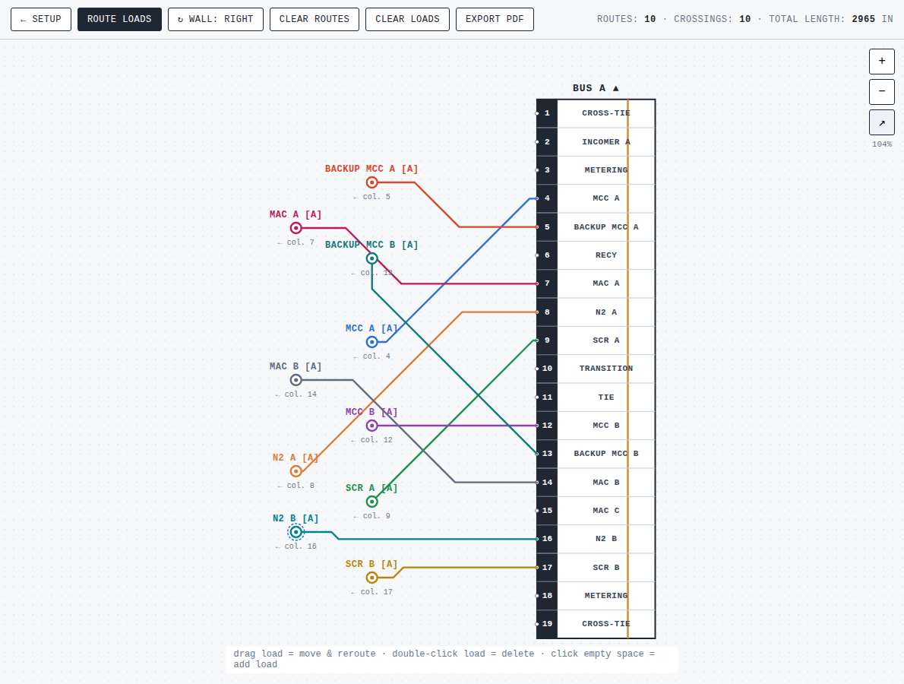

# Underground Route Planner

A browser-based tool for planning the best **underground cable routes** between
feeder panels and their loads. It runs entirely client-side (no build step, no
server) and is designed to be hosted on **GitHub Pages**.



## What it does

1. **Define panels.** Open **SETUP** and describe one or more panels: a name,
   the number of columns, and (optionally) a label per column. Every column is
   always **3 ft (36 in)** wide. A non-connectable, 4.156 in **END SECTION** is
   drawn automatically before the first column and after the last column; the
   lineup length includes both end sections.

2. **Place & orient panels.** In **SETUP** mode drag a panel to move it, or use
   the **↻** handle (or the **WALL** button) to rotate it. The column order you
   defined is always preserved, whatever the orientation.

3. **Add loads.** In **ROUTE LOADS** mode, click an empty spot on the drawing.
   You are asked for the load's **tag**, the **panel** it feeds, and the
   **column** it lands on. Drag a load to move it; **double-click** to delete
   it.

4. **Mark deep foundations.** Select **DRAW FOUNDATION**, then drag over the
   plan to draw a rectangular restricted area. Routes automatically avoid the
   foundation with a **12 in clearance**. Drag a foundation to move it; press
   **Del** (with it selected) or **double-click** it to delete it.

5. **Mark tag rectangles.** Select **DRAW TAG**, then drag over the plan to
   draw a labelled rectangle — a pure drawing marker for things like loads or
   panel areas. Tag rectangles never affect the routes. You are asked for the
   **tag** as soon as the rectangle is drawn; the label stays centred in the
   rectangle. Drag to move; press **Del** (with it selected) or
   **double-click** to delete.

6. **Auto-route.** Routes are computed automatically (and re-computed as you
   drag). Each load is wired to its column following three rules, in order:
   - **minimise the number of crossings** between routes,
   - use only **45° bends and straight runs** (octilinear),
   - keep each route **as short as possible**.

   The status bar reports the live **route count**, **crossing count** and
   **total length**. If a load or panel connection is trapped inside a
   foundation, the affected route is shown as a dashed red line and counted as
   **BLOCKED**.

7. **Export.** **EXPORT PDF** opens a clean, print-ready view of the full
   drawing — use your browser's *Save as PDF*.

### Toolbar

| Button | Action |
| --- | --- |
| **← SETUP** | Configure panels (add/remove, rename, set columns & labels). |
| **ROUTE LOADS** | Working mode: add / move / delete loads and route them. |
| **DRAW FOUNDATION** | Draw rectangular deep-foundation areas that routes must avoid. |
| **DRAW TAG** | Draw labelled rectangles that mark loads/panel areas without affecting routes. |
| **↻ WALL: …** | Rotate all panels to back onto the next wall (RIGHT → BOTTOM → LEFT → TOP). |
| **CLEAR ROUTES** | Hide the current routes (they return on the next change). |
| **CLEAR LOADS** | Remove every load. |
| **CLEAR FOUNDATIONS** | Remove every deep-foundation area. |
| **EXPORT PDF** | Open a print-ready drawing. |

Zoom with the on-screen **+ / − / ⤢** controls or the mouse wheel; pan by
dragging empty space. Your work is saved to the browser's local storage.

## Running locally

It is plain static files, so any static server works:

```bash
npx http-server -p 8099 -c-1
# then open http://localhost:8099
```

(Opening `index.html` directly via `file://` will not work because the app uses
ES modules, which browsers only load over `http(s)`.)

## Hosting on GitHub Pages

The whole app is static files at the repository root, so the simplest way to
publish is to serve the branch directly:

1. Go to **Settings → Pages**.
2. Under **Build and deployment → Source**, choose **Deploy from a branch**.
3. Pick this branch and the **`/ (root)`** folder, then **Save**.

The included `.nojekyll` file makes Pages serve the `js/` and `css/` folders
as-is. The site goes live at `https://<user>.github.io/<repo>/` within a
minute or so.

## Project layout

```
index.html          markup + modals
css/styles.css       styling
js/geometry.js       transforms, 45° path construction, crossing tests
js/store.js          application state + localStorage persistence
js/router.js         auto-routing and crossing minimisation
js/render.js         SVG rendering + view fitting
js/pdf.js            print-ready export
js/main.js           UI wiring (modes, modals, pointer, zoom/pan)
```
